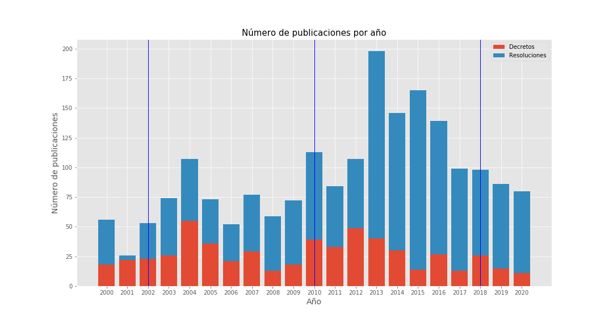
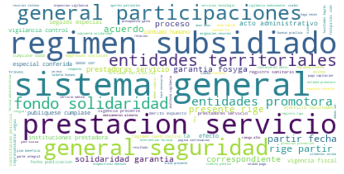
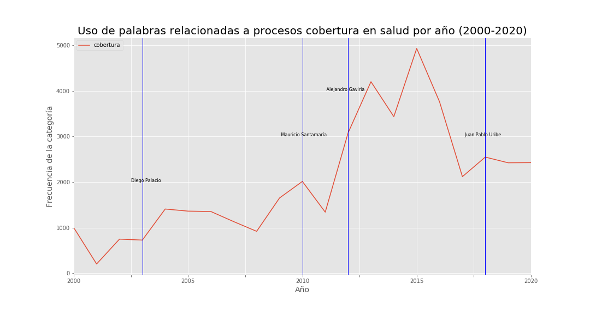
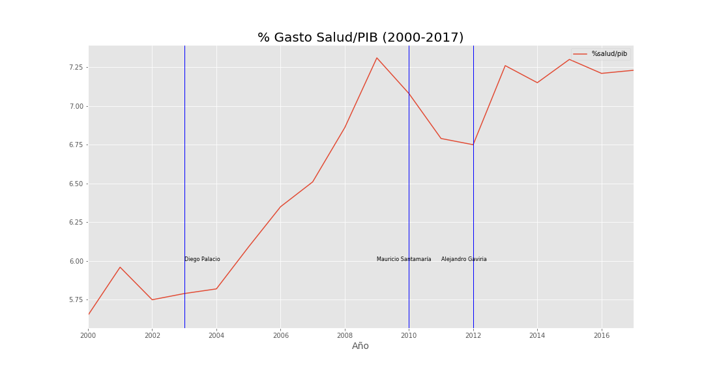
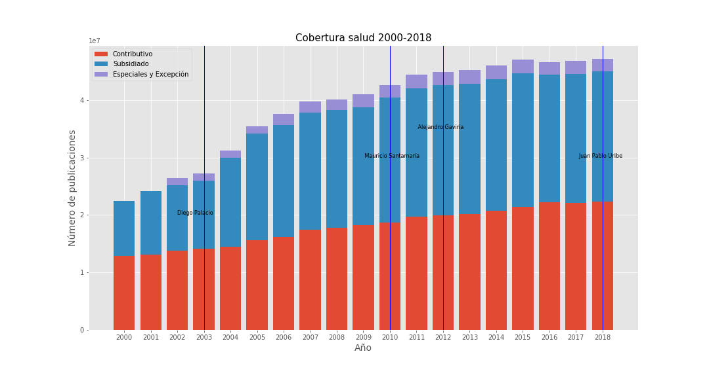
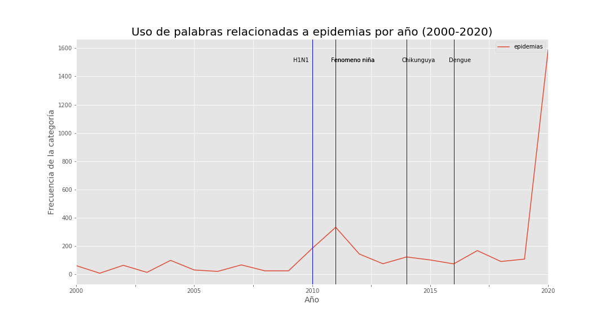
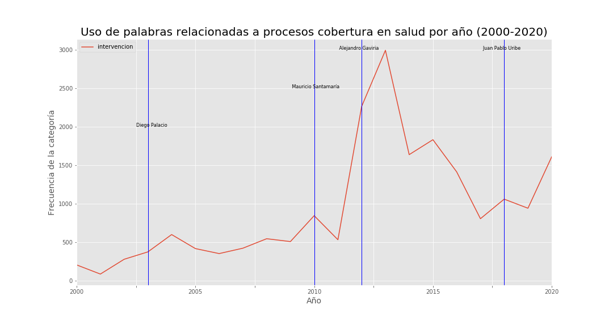
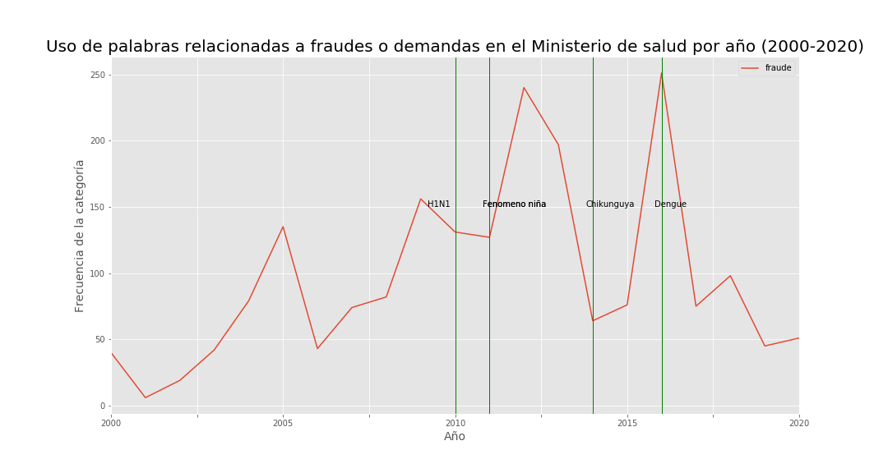
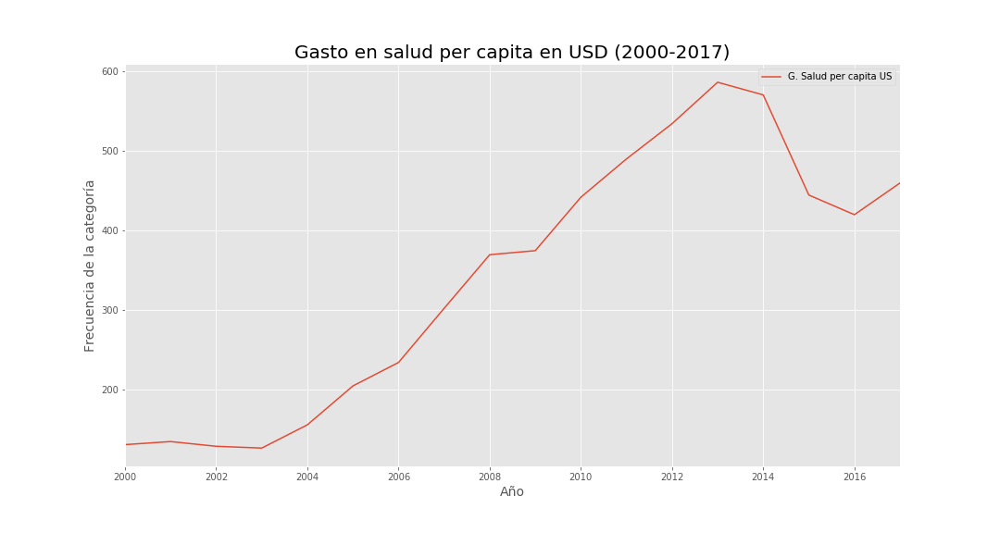

# Decretos y Resoluciones del Ministerio de Salud y Protección Social de Colombia (2000-2020)

## Descripción y Motivación 

El Ministerio de Salud y Protección Social es una entidad pública del nivel central del Gobierno Nacional y cabeza del sector salud, encargada de conocer, dirigir, evaluar y orientar el sistema de seguridad social en salud, mediante la formulación de políticas, planes y programas, la coordinación intersectorial y la articulación de actores de salud con el fin de mejorar la calidad, oportunidad, accesibilidad de los servicios de salud y sostenibilidad del sistema, incrementando los niveles de satisfacción de los pacientes, familias, comunidades y habitantes del territorio nacional.

A Continuación, la definición de dichos documentos: 

1. Según el archivo nacional de la nación, un Decreto es un acto administrativo promulgado por el poder ejecutivo con contenido normativo reglamentario sin necesidad de ser sometida al órgano legislativo. Cuando se habla de un decreto ley se trata de un acto que ofrece la posibilidad de tener aplicación con fuerza de ley sin que necesite la intervención del congreso, generalmente se da cuando existen necesidades que deben ser ejecutadas con urgencia.

Definición en el link siguiente: [Definición Decretos](https://normativa.archivogeneral.gov.co/inicio/decretos/) 

2. Según el archivo nacional de la nación, una Resolución es un acto procesal emanado por un tribunal, mediante el cual se resuelve una controversia originada entre las partes, así mismo puede autorizar u ordenar el cumplimiento de medidas específicas. 

Definición en el link siguiente: [Definición Resoluciones](https://normativa.archivogeneral.gov.co/inicio/resoluciones/)

Según estudios de [McKensey](https://www.mckinsey.com/featured-insights/artificial-intelligence/visualizing-the-uses-and-potential-impact-of-ai-and-other-analytics), el análisis del datos referente a información no estructurada como audios, textos e imagen, a futuro tienen gran potencial debido a su gran cantidad de datos que almacén y su poca investigación en la actualidad.

Dado lo anterior, el presente documento tiene como objetivo hacer el análisis exploratorio de los datos encontrados en la extracción de información no estructurada como los son textos en formato PDF. Así, se usarán los actos administrativos más relevantes de los entres de control como lo son los Decretos y las resoluciones, tomando el intervalo del año 2000 a mayo del 2020. En el análisis exploratorio se relacionarán indicadores macroeconómicos con el fin de dar insumos para investigaciones futuras de efectos causales y correlaciones estadísticas. 

Las siguientes son interrogantes que motivaron el análisis de los dos actos administrativos: 

- A lo largo de los últimos 20 años se han presentado varias enfermedades a nivel mundial, ¿Los datos reflejan las normativas y controles que tuvo Colombia para manejar dichas problemáticas? 
- El nivel de gasto público en salud ha estado en constante fluctuación en los últimos años, ¿los documentos reflejan este cambio político en los últimos 20 años? 
- A medida que un país genera más ingresos, su bienestar social aumenta y así mismo la cobertura en salud a nivel país. ¿Los datos reflejan la dinámica de cobertura en salud en Colombia?
- ¿Los actos administrativos expedidos en Colombia a partir del año 2000, pueden dar luz de la razón por la cual ha habido un mayor aumento en las afiliaciones tanto de régimen contributivo como régimen subsidiado?

----
## Metodologías: 

### 1. Scrapping:

El proceso de Scrapping se divide en dos scripts, en [Scrapping_Decretos_MinSalud.ipynb](Decretos/Scrapping_Decretos_MinSalud.ipynb) se encuentra el proceso para los decretos y en [Scrapping_Resoluciones_MinSalud.ipynb](Resoluciones/Scrapping_Resoluciones_MinSalud.ipynb) se encuentra el proceso para las resoluciones.

Cada código tiene dos funcionalidades:
1. La primera es traer el número de registros, año e indicativo del año para así mismo desarrollar el scrapping de la página.
   - 558 Decretos [Decretos MinSalud](https://www.minsalud.gov.co/Paginas/Norm_Decretos.aspx)
   - 1406 Resoluciones [Resoluciones MinSalud](https://www.minsalud.gov.co/Paginas/Norm_Resoluciones.aspx) 
 
 
Las líneas verticales son las marcas de cambio de gobiernos presidencial.

2. La segunda parte, con la ayuda de [Selenium](https://github.com/SeleniumHQ/selenium) hace el scrapping de la página del ministerio simulando los click necesarios para el proceso, esto para traer el link de cada documento para descargarlo en proceso posterior. En cada script se encuentra el proceso anteriormente descrito a través de imágenes ilustrativas.

Para este último scrapping es necesario descargar el ejecutable del siguiente link, como complemento de selenium:
[Chromedriver selenium](https://chromedriver.chromium.org/)

La finalidad de estos scripts anteriores es obtener la ruta de cada uno de los PDFs de las resoluciones del Ministerio de salud, publicados en la página web y traer esta información en un Dataframe para exportar a excel.

## 2. Descarga de PDFs y trasncripción de textos:

El proceso de Descarga de PDFs y transcripción de textos se divide en dos scripts, en [Código descarga PDFs Decretos](Decretos/Descarga_PDFs_%26_Trasncripci%C3%B3n_decretos.ipynb) se encuentra el proceso para los decretos y en [Código descarga PDFs Resoluciones](Resoluciones/Descarga_PDFs_%26_Trasncripci%C3%B3n_resoluciones.ipynb) se encuentra el proceso para las resoluciones.

Cada código tiene dos funcionalidades:
 1. La primera es descargar cada uno de los documentos publicados en la página del Miniterio de Salud, con base al Scrapping realizado en los scripts [Scrapping Decretos](Decretos/Scrapping_Decretos_MinSalud.ipynb) y [Scrapping Resoluciones](Resoluciones/Scrapping_Resoluciones_MinSalud.ipynb) , esto con ayuda de la librería "urllib".
 2. La segunda parte, transcribe los pdf a texto y valida si los textos tienen menos de 200 palabras para transformar dichos PDFs en archivos Word y posteriormente reescribir el archivo PDF, esto debido a que hay textos que se publican y son realizados a través de escaneos; por tanto, una manera de solucionar esto es la descrita anteriormente.

La finalidad de estos scripts es obtener cada uno de los textos de los documentos y generar un Dataframe para exportar como excel para el análisis de texto.

## 3. Consolidación y limpieza:

Con ayuda de las librerías Pandas, nltk, sklearn y matplotlib, se hace la manipulación de las bases de datos obtenidos en los procesos de transcripción de PDFs a textos. Dado lo anterior, se generaron 4 diccionarios de palabras para las siguientes categorías:
- Epidemias
- Cobertura
- Intervención
- Fraude

---
# Análisis: 

En el siguiente link se encuentra el código del análisis: [Código_análisis](https://github.com/ccamilocristian/MCPP_cristian.moreno/blob/master/Proyecto%20final/Analisis%20texto/Analisis_textos.ipynb)

Los Datos macro relacionados al sector salud en Colombia fueron sacados de:

1. Los indicadores Macro sobre gasto en salud y número de médicos y enfermeras por cada 1000 habitantes fueron sacados del Banco Mundial: https://datos.bancomundial.org/pais/colombia
2. Los datos sobre cobertura en Colombia son sacados del Ministerio de Salud: https://www.minsalud.gov.co/proteccionsocial/Regimensubsidiado/Paginas/coberturas-del-regimen-subsidiado.aspx

Cobertura:

Imagen 1.

Imagen 2.

Imagen 3.

Cada línea vertical relaciona el cambio de Ministro de Salud y el nombre de la persona que entró en dicho año. Se ve en la imagen 1 una tendencia creciente en el tratamiento de temas de cobertura, pero un pico muy pronunciado en el Gobierno de Alejandro Gaviria. Esto anterior, puede confirmar dicha información con los % de coberturas de la imagen 3, en donde hay un crecimiento en la cobertura en salud a nivel nacional tanto para el régimen subsidiario y el régimen contributivo.

Epidemias:

Imagen 4.

Intervenciones:

Imagen 5.

Fraude y demandas:

Imagen 6.

Imagen 7.

Dado el análisis de las imágenes 1 a la 3, aun cuando se ve un aumento en la cobertura y la relevancia de este tema en los decretos y resoluciones, estos documentos también toman mucha relevancia en temas de intervenciones a instituciones públicas de salud y los fraudes y demandas después del fenómeno de la niña, lo cual puede deberse a ineficiencias en dicho sector y un posible alto grado de corrupción. Como se observa en la imagen 7, aunque hubo un aumento creciente de gasto/PIB a lo largo de últimos 20 años, el gasto per capita sufrió una gran caída en el año 2015. 

Para análisis posteriores, se recomienda investigar temas de corrupción y desvíos de dineros públicos.

--- 

Investigaciones a futuro:
1. Analizar correlaciones y efectos externos como corrupción en este ente de control.
2. Realizar un análisis causal de indicadores de ineficiencia de los centros de salud en cada año, para ver el impacto de dichos datos en el número de intervenciones realizadas por el ministerio.
3. Revisar la dinámica de pensionados y subsidiados a lo largo del tiempo y si esto tiene significancia estadística con el aumento en cobertura en salud.
